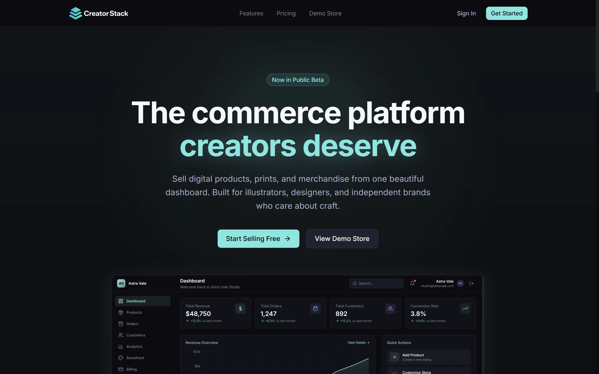

# Creator Stack

A modern SaaS platform designed for creators to sell digital products, prints, and merchandise through a unified storefront and dashboard system.

Built with a focus on clarity, scalability, and real-world product experience.

---




---


## 🚀 Overview

Creator Stack is a full-featured creator commerce platform that combines:

* Storefront management
* Product creation and organization
* Order tracking
* Analytics and performance insights

All within a clean, intuitive dashboard built for both beginner and advanced creators.

This project explores the intersection of **UI/UX design and frontend architecture**, delivering a product-level experience rather than a simple interface mockup.

---

## ✨ Features

* 📊 **Analytics Dashboard**

  * Revenue tracking
  * Order and customer insights
  * Conversion metrics

* 🛍️ **Product Management**

  * Create and manage digital products
  * Organize listings for storefront display

* 📦 **Order Tracking**

  * Monitor recent orders
  * Status indicators (completed, processing, etc.)

* ⚡ **Quick Actions Panel**

  * Add products
  * Customize storefront
  * Access analytics quickly

* 💳 **Pricing System**

  * Tiered subscription model
  * Clear feature differentiation
  * Upgrade-focused UX patterns

* 🎯 **Marketing Layer**

  * Conversion-focused landing page
  * Strong CTA hierarchy
  * Product preview integration

---

## 🧱 Tech Stack

* **Frontend:** React + Vite
* **Styling:** Tailwind CSS / Custom CSS System
* **Language:** JavaScript
* **Architecture:** Component-based, modular UI system

---

## 🧩 Architecture Highlights

* Scalable component structure for rapid feature expansion
* Reusable UI patterns (cards, tables, metrics, layouts)
* Clean separation between marketing pages and application dashboard
* Optimized layout system for readability and performance

---

## 🎨 Design Approach

This project was designed with a product-first mindset:

* **Clarity over decoration**
* **Strong visual hierarchy**
* **Dark UI with restrained accent color usage**
* **Data readability as a priority**
* **Consistent spacing and layout system**

The goal was to create an interface that feels **premium, intentional, and scalable**—similar to modern SaaS tools used in production.

---

## 📸 Key Screens

* Landing Page (Marketing & Conversion)
* Pricing (Product Clarity)
* Dashboard (Core Experience)

---

## 🧪 Purpose

This is a **portfolio-level project** built to demonstrate:

* UI/UX design thinking
* Frontend engineering capability
* SaaS product architecture
* Real-world dashboard design patterns

---

## 🔮 Future Improvements

* Authentication system (JWT / OAuth)
* Backend integration (Node / Express / PostgreSQL)
* Stripe subscription handling
* Storefront public pages
* File uploads for digital products
* Role-based user permissions

---

## ⚙️ Getting Started

```bash
# Install dependencies
npm install

# Run development server
npm run dev

# Build for production
npm run build
```

---

## 🌐 Deployment

Recommended: **Vercel**

Make sure your build output is set correctly (typically `dist` for Vite projects).

---

## 👤 Author

Built by Jeremy (Hungry Ghost DEV)

* UI/UX Designer + Frontend Developer
* Focused on building scalable, high-performance web applications

---

## 📌 Final Note

This project is not just a UI exercise — it is a **product-focused build** designed to reflect real-world SaaS platforms, combining design systems, frontend architecture, and user experience into a cohesive application.

---

**Clarity. Precision. Systems that work.**
